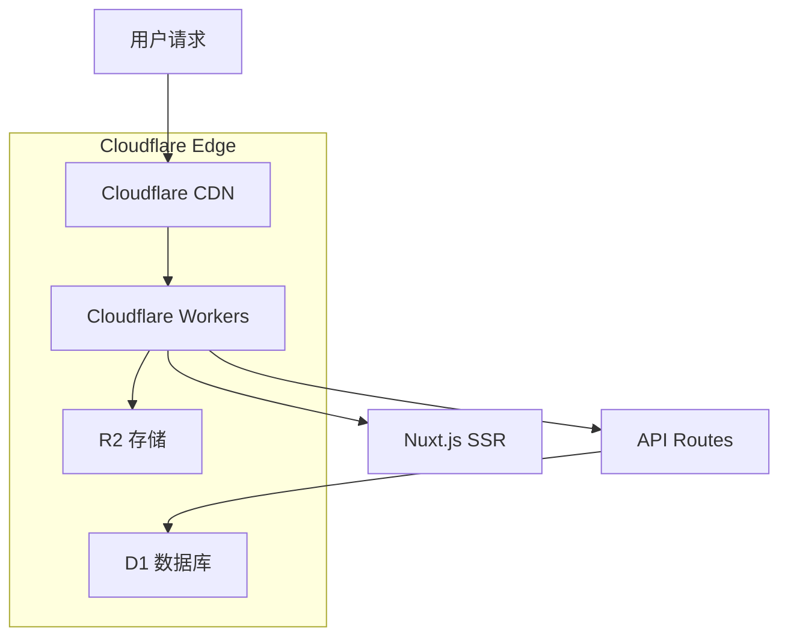

# AndyGame - 游戏中心

一个基于 Nuxt.js 3 和 Cloudflare Workers 的现代化全栈游戏平台，提供多种在线小游戏和互动功能。

## 🎮 项目特色

- **多样化游戏集合**：包含7款经典小游戏
- **全栈架构**：前后端一体化开发
- **云原生部署**：基于 Cloudflare Workers 的边缘计算
- **现代化UI**：使用 Element Plus 和 UnoCSS
- **响应式设计**：支持多设备访问

## 🎯 功能特性

### 🕹️ 游戏中心
- **漂流瓶游戏** (`bottle.vue`) - 社交互动游戏
- **坦克大战** (`tank.vue`) - 经典射击游戏  
- **打字练习** (`typing.vue`) - 提升打字速度
- **钓鱼游戏** (`fishing.vue`) - 休闲娱乐
- **扫雷游戏** (`minesweeper.vue`) - 逻辑推理
- **飞机大战** (`plane.vue`) - 动作射击
- **贪吃蛇** (`snake.vue`) - 经典街机

### 📊 数据管理
- **运动记录追踪** - 记录用户运动数据
- **运动类型管理** - 支持多种运动类型
- **文件上传功能** - 支持图片和文档上传

### 🎨 界面特性
- **暗黑模式切换** - 支持明暗主题
- **响应式布局** - 适配各种屏幕尺寸
- **现代化UI组件** - 基于 Element Plus

## 🛠️ 技术栈

### 前端技术
- **框架**: [Nuxt.js 3](https://nuxt.com/) - Vue.js 全栈框架
- **UI库**: [Element Plus](https://element-plus.org/) - Vue 3 组件库
- **样式**: [UnoCSS](https://unocss.dev/) - 原子化CSS引擎
- **状态管理**: [Pinia](https://pinia.vuejs.org/) - Vue 状态管理
- **图标**: [Element Plus Icons](https://element-plus.org/zh-CN/component/icon.html)
- **工具库**: [VueUse](https://vueuse.org/) - Vue 组合式API工具集

### 后端技术
- **运行时**: [Cloudflare Workers](https://workers.cloudflare.com/) - 边缘计算平台
- **数据库**: [Cloudflare D1](https://developers.cloudflare.com/d1/) - SQLite 数据库
- **存储**: [Cloudflare R2](https://developers.cloudflare.com/r2/) - 对象存储
- **API**: Nuxt 3 服务器API

### 开发工具
- **语言**: TypeScript
- **包管理**: pnpm
- **代码检查**: ESLint
- **样式预处理**: Sass/SCSS
- **部署工具**: Wrangler CLI

## 📁 项目结构

```
AndyGame-1/
├── app/                          # 应用源码
│   ├── components/              # Vue 组件
│   │   ├── example/            # 示例组件
│   │   ├── DarkToggle.vue      # 暗黑模式切换
│   │   ├── FileUpload.vue      # 文件上传组件
│   │   └── ...
│   ├── layouts/                # 布局组件
│   │   ├── default.vue         # 默认布局
│   │   ├── game.vue           # 游戏布局
│   │   └── home.vue           # 首页布局
│   ├── pages/                  # 页面路由
│   │   ├── games/             # 游戏页面
│   │   │   ├── bottle.vue     # 漂流瓶游戏
│   │   │   ├── tank.vue       # 坦克大战
│   │   │   ├── snake.vue      # 贪吃蛇
│   │   │   └── ...
│   │   ├── sports.vue         # 运动记录
│   │   └── ...
│   ├── stores/                 # Pinia 状态管理
│   ├── composables/           # 组合式函数
│   ├── assets/                # 静态资源
│   └── constants/             # 常量定义
├── server/                      # 服务器API
│   └── api/                    # API 接口
│       ├── bottle/            # 漂流瓶API
│       ├── files/             # 文件管理API
│       ├── sports/            # 运动记录API
│       └── sport-types.ts     # 运动类型API
├── migrations/                  # 数据库迁移
├── public/                     # 公共静态文件
├── nuxt.config.ts             # Nuxt 配置
├── wrangler.toml              # Cloudflare Workers 配置
└── package.json               # 项目依赖
```

## 🚀 快速开始

### 环境要求
- Node.js 18+
- pnpm 8+
- Cloudflare 账户

### 1. 克隆项目
```bash
git clone <repository-url>
cd AndyGame-1
```

### 2. 安装依赖
```bash
pnpm install
```

### 3. 配置环境

#### 3.1 Cloudflare D1 数据库
```bash
# 创建 D1 数据库
wrangler d1 create andydb

# 运行数据库迁移
wrangler d1 migrations apply andydb --local
wrangler d1 migrations apply andydb --remote
```

#### 3.2 Cloudflare R2 存储
```bash
# 创建 R2 存储桶
wrangler r2 bucket create andy-game-assets
```

#### 3.3 更新 wrangler.toml
确保 `wrangler.toml` 中的数据库ID和存储桶名称正确。

### 4. 本地开发

#### 4.1 构建项目
```bash
pnpm build
```

#### 4.2 启动开发服务器
```bash
wrangler dev .output/server/index.mjs --site .output/public --local --port 8787
```

访问 `http://localhost:8787` 查看应用。

### 5. 部署到生产环境

#### 5.1 部署到 Cloudflare Workers
```bash
npx wrangler deploy
```

## 📚 可用脚本

```bash
# 开发模式（Nuxt 开发服务器）
pnpm dev

# 构建项目
pnpm build

# 本地预览构建结果
pnpm preview

# 代码检查
pnpm lint

# 修复代码格式
pnpm lint:fix

# 类型检查
pnpm typecheck

# 部署到 Cloudflare
pnpm deploy
```

## 🎯 部署架构



### 部署特点
- **边缘计算**: 代码在全球边缘节点运行，响应速度快
- **无服务器**: 按需运行，自动扩缩容
- **全球CDN**: 静态资源全球分发
- **D1数据库**: 分布式SQLite数据库
- **R2存储**: 对象存储，支持大文件

## 🔧 配置说明

### Nuxt 配置 (`nuxt.config.ts`)
- **SSR模式**: 服务器端渲染
- **Cloudflare预设**: 针对Workers优化
- **TypeScript**: 完整类型支持
- **自动导入**: 组件和组合式函数

### Cloudflare 配置 (`wrangler.toml`)
- **D1数据库绑定**: `DB` 变量
- **R2存储绑定**: `ASSETS` 变量
- **环境配置**: 本地和生产环境

## 🗄️ 数据库结构

### bottles 表 - 漂流瓶
```sql
CREATE TABLE bottles (
    id INTEGER PRIMARY KEY AUTOINCREMENT,
    content TEXT NOT NULL,
    user_id TEXT NOT NULL,
    is_read BOOLEAN DEFAULT FALSE,
    created_at TIMESTAMP DEFAULT CURRENT_TIMESTAMP
);
```

### sports_records 表 - 运动记录
```sql
CREATE TABLE sports_records (
    id INTEGER PRIMARY KEY AUTOINCREMENT,
    user_id TEXT NOT NULL,
    sport_type_id INTEGER NOT NULL,
    duration INTEGER,
    distance REAL,
    calories INTEGER,
    created_at TIMESTAMP DEFAULT CURRENT_TIMESTAMP
);
```

## 🤝 贡献指南

1. Fork 项目
2. 创建功能分支 (`git checkout -b feature/AmazingFeature`)
3. 提交更改 (`git commit -m 'Add some AmazingFeature'`)
4. 推送到分支 (`git push origin feature/AmazingFeature`)
5. 开启 Pull Request

## 📝 许可证

本项目采用 MIT 许可证 - 查看 [LICENSE](LICENSE) 文件了解详情。

## 🔗 相关链接

- [Nuxt.js 文档](https://nuxt.com/docs)
- [Element Plus 文档](https://element-plus.org/)
- [Cloudflare Workers 文档](https://developers.cloudflare.com/workers/)
- [Cloudflare D1 文档](https://developers.cloudflare.com/d1/)
- [UnoCSS 文档](https://unocss.dev/)

## 📞 支持

如果您在使用过程中遇到问题，请：

1. 查看 [Issues](../../issues) 中是否已有相似问题
2. 创建新的 Issue 描述您的问题
3. 提供详细的错误信息和重现步骤

---

**享受游戏时光！** 🎮✨ 