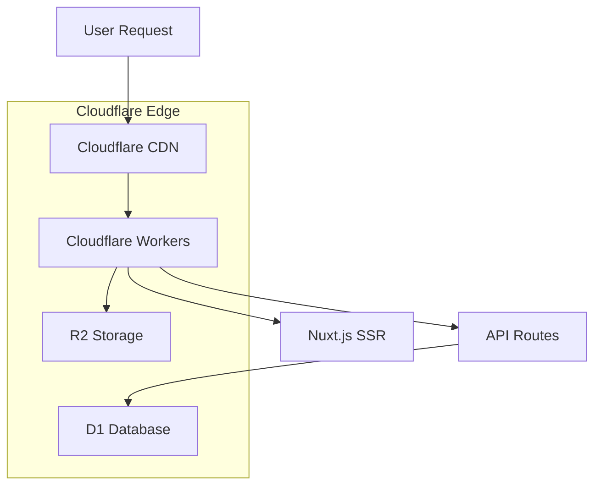

# AndyGame - Game Center

A modern full-stack gaming platform based on Nuxt.js 3 and Cloudflare Workers, offering multiple online mini-games and interactive features.
nodejs

## 🎮 Features

- **Diverse Game Collection**: Includes 7 classic mini-games
- **Full-Stack Architecture**: Integrated frontend and backend development
- **Cloud-Native Deployment**: Edge computing based on Cloudflare Workers
- **Modern UI**: Using Element Plus and UnoCSS
- **Responsive Design**: Supports multi-device access

## 🎯 Functionality

### 🕹️ Game Center
- **Bottle Game** (`bottle.vue`) - Social interaction game
- **Tank Battle** (`tank.vue`) - Classic shooting game
- **Typing Practice** (`typing.vue`) - Improve typing speed
- **Fishing Game** (`fishing.vue`) - Casual entertainment
- **Minesweeper** (`minesweeper.vue`) - Logic puzzle
- **Plane Battle** (`plane.vue`) - Action shooting
- **Snake Game** (`snake.vue`) - Classic arcade

### 📊 Data Management
- **Sports Records Tracking** - Record user sports data
- **Sport Types Management** - Support for multiple sport types
- **File Upload Feature** - Support for image and document uploads

### 🎨 Interface Features
- **Dark Mode Toggle** - Support for light and dark themes
- **Responsive Layout** - Adapts to various screen sizes
- **Modern UI Components** - Based on Element Plus

## 🛠️ Tech Stack

### Frontend Technologies
- **Framework**: [Nuxt.js 3](https://nuxt.com/) - Vue.js full-stack framework
- **UI Library**: [Element Plus](https://element-plus.org/) - Vue 3 component library
- **Styling**: [UnoCSS](https://unocss.dev/) - Atomic CSS engine
- **State Management**: [Pinia](https://pinia.vuejs.org/) - Vue state management
- **Icons**: [Element Plus Icons](https://element-plus.org/zh-CN/component/icon.html)
- **Utility Library**: [VueUse](https://vueuse.org/) - Vue Composition API utilities

### Backend Technologies
- **Runtime**: [Cloudflare Workers](https://workers.cloudflare.com/) - Edge computing platform
- **Database**: [Cloudflare D1](https://developers.cloudflare.com/d1/) - SQLite database
- **Storage**: [Cloudflare R2](https://developers.cloudflare.com/r2/) - Object storage
- **API**: Nuxt 3 Server API

### Development Tools
- **Language**: TypeScript
- **Package Manager**: pnpm
- **Linting**: ESLint
- **Style Preprocessing**: Sass/SCSS
- **Deployment Tool**: Wrangler CLI

## 📁 Project Structure

```
AndyGame-1/
├── app/                          # Application source code
│   ├── components/              # Vue components
│   │   ├── example/            # Example components
│   │   ├── DarkToggle.vue      # Dark mode toggle
│   │   ├── FileUpload.vue      # File upload component
│   │   └── ...
│   ├── layouts/                # Layout components
│   │   ├── default.vue         # Default layout
│   │   ├── game.vue           # Game layout
│   │   └── home.vue           # Home layout
│   ├── pages/                  # Page routes
│   │   ├── games/             # Game pages
│   │   │   ├── bottle.vue     # Bottle game
│   │   │   ├── tank.vue       # Tank battle
│   │   │   ├── snake.vue      # Snake game
│   │   │   └── ...
│   │   ├── sports.vue         # Sports records
│   │   └── ...
│   ├── stores/                 # Pinia state management
│   ├── composables/           # Composable functions
│   ├── assets/                # Static assets
│   └── constants/             # Constant definitions
├── server/                      # Server API
│   └── api/                    # API endpoints
│       ├── bottle/            # Bottle API
│       ├── files/             # File management API
│       ├── sports/            # Sports records API
│       └── sport-types.ts     # Sport types API
├── migrations/                  # Database migrations
├── public/                     # Public static files
├── nuxt.config.ts             # Nuxt configuration
├── wrangler.toml              # Cloudflare Workers configuration
└── package.json               # Project dependencies
```

## 🚀 Quick Start

### Requirements
- Node.js 18+
- pnpm 8+
- Cloudflare account

### 1. Clone the project
```bash
git clone <repository-url>
cd AndyGame-1
```

### 2. Install dependencies
```bash
pnpm install
```

### 3. Configure environment

#### 3.1 Cloudflare D1 Database
```bash
# Create D1 database
wrangler d1 create andydb

# Run database migrations
wrangler d1 migrations apply andydb --local
wrangler d1 migrations apply andydb --remote
```

#### 3.2 Cloudflare R2 Storage
```bash
# Create R2 storage bucket
wrangler r2 bucket create andy-game-assets
```

#### 3.3 Update wrangler.toml
Make sure the database ID and bucket name in `wrangler.toml` are correct.

### 4. Local Development

#### 4.1 Build the project
```bash
pnpm build
```

#### 4.2 Start development server
```bash
wrangler dev .output/server/index.mjs --site .output/public --local --port 8787
```

Visit `http://localhost:8787` to view the application.

### 5. Deploy to Production

#### 5.1 Deploy to Cloudflare Workers
```bash
npx wrangler deploy
```

## 📚 Available Scripts

```bash
# Development mode (Nuxt dev server)
pnpm dev

# Build project
pnpm build

# Preview build locally
pnpm preview

# Lint code
pnpm lint

# Fix code formatting
pnpm lint:fix

# Type check
pnpm typecheck

# Deploy to Cloudflare
pnpm deploy
```

## 🎯 Deployment Architecture



### Deployment Features
- **Edge Computing**: Code runs on global edge nodes with fast response times
- **Serverless**: Runs on-demand with automatic scaling
- **Global CDN**: Static assets distributed globally
- **D1 Database**: Distributed SQLite database
- **R2 Storage**: Object storage supporting large files

## 🔧 Configuration

### Nuxt Configuration (`nuxt.config.ts`)
- **SSR Mode**: Server-side rendering
- **Cloudflare Preset**: Optimized for Workers
- **TypeScript**: Full type support
- **Auto-imports**: Components and composable functions

### Cloudflare Configuration (`wrangler.toml`)
- **D1 Database Binding**: `DB` variable
- **R2 Storage Binding**: `ASSETS` variable
- **Environment Configuration**: Local and production environments

## 🗄️ Database Schema

### bottles table - Message in a Bottle
```sql
CREATE TABLE bottles (
    id INTEGER PRIMARY KEY AUTOINCREMENT,
    content TEXT NOT NULL,
    user_id TEXT NOT NULL,
    is_read BOOLEAN DEFAULT FALSE,
    created_at TIMESTAMP DEFAULT CURRENT_TIMESTAMP
);
```

### sports_records table - Sports Records
```sql
CREATE TABLE sports_records (
    id INTEGER PRIMARY KEY AUTOINCREMENT,
    user_id TEXT NOT NULL,
    sport_type_id INTEGER NOT NULL,
    duration INTEGER,
    distance REAL,
    calories INTEGER,
    created_at TIMESTAMP DEFAULT CURRENT_TIMESTAMP
);
```

## 🤝 Contributing

1. Fork the project
2. Create a feature branch (`git checkout -b feature/AmazingFeature`)
3. Commit your changes (`git commit -m 'Add some AmazingFeature'`)
4. Push to the branch (`git push origin feature/AmazingFeature`)
5. Open a Pull Request

## 📝 License

This project is licensed under the MIT License - see the [LICENSE](LICENSE) file for details.

## 🔗 Related Links

- [Nuxt.js Documentation](https://nuxt.com/docs)
- [Element Plus Documentation](https://element-plus.org/)
- [Cloudflare Workers Documentation](https://developers.cloudflare.com/workers/)
- [Cloudflare D1 Documentation](https://developers.cloudflare.com/d1/)
- [UnoCSS Documentation](https://unocss.dev/)

## 📞 Support

If you encounter any issues while using this project, please:

1. Check if similar issues already exist in [Issues](../../issues)
2. Create a new Issue describing your problem
3. Provide detailed error information and steps to reproduce

---

**Enjoy your gaming time!** 🎮✨
